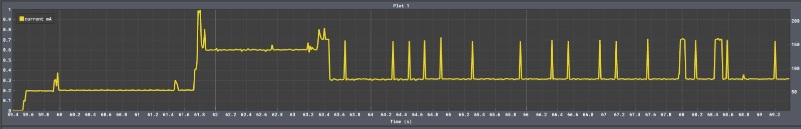
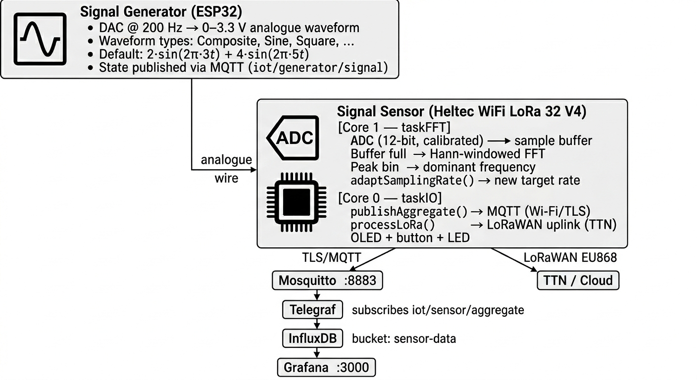
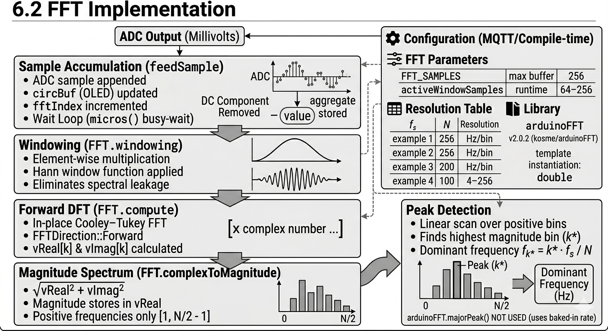
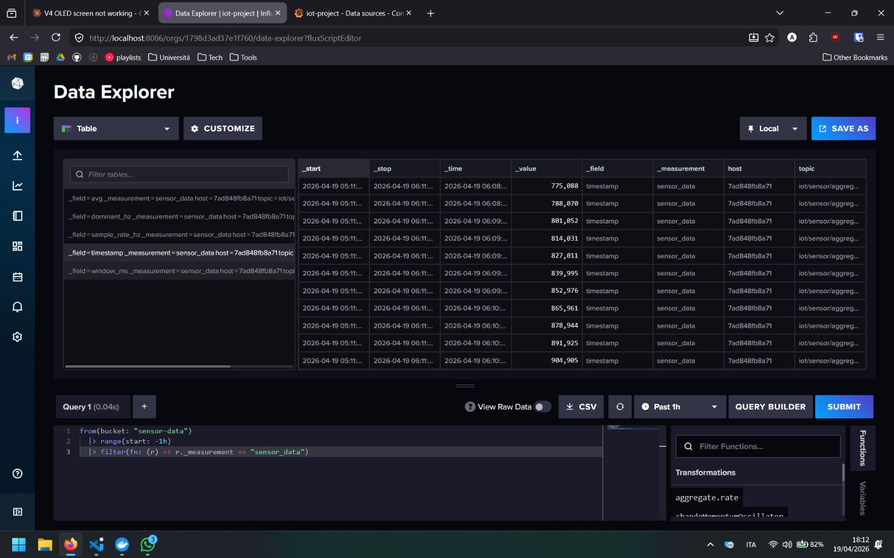
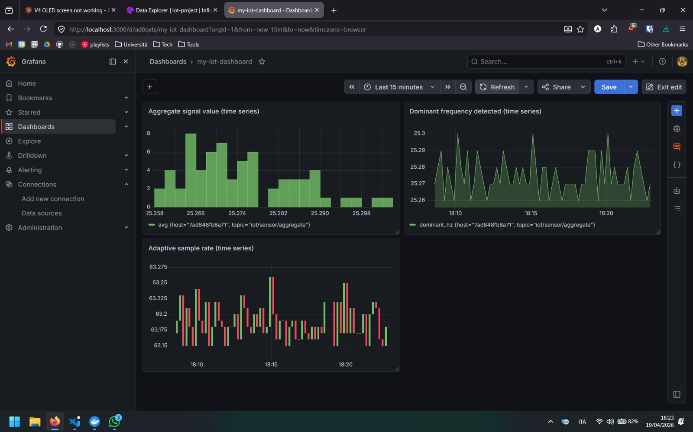

# IoT Signal Sensor — Technical README

## Table of Contents

1. [Project Overview](#1-project-overview)
2. [Repository Structure](#2-repository-structure)
3. [Hardware](#3-hardware)
4. [System Architecture](#4-system-architecture)
5. [Signal Generator (`signal-generator-v1`)](#5-signal-generator-signal-generator-v1)
6. [Signal Sensor (`signal-sensor-v4`)](#6-signal-sensor-signal-sensor-v4)
   - [ADC Configuration](#61-adc-configuration)
   - [FFT Implementation](#62-fft-implementation)
   - [Adaptive Sampling Rate](#63-adaptive-sampling-rate)
   - [Aggregate Computation](#64-aggregate-computation)
   - [Dual-Core FreeRTOS Architecture](#65-dual-core-freertos-architecture)
   - [MQTT Communication (Wi-Fi)](#66-mqtt-communication-wi-fi)
   - [LoRaWAN Communication (TTN)](#67-lorawan-communication-ttn)
7. [Edge Server Infrastructure](#7-edge-server-infrastructure)
8. [Python Control Script (`mqtt_demo.py`)](#8-python-control-script-mqtt_demopy)
9. [Performance Measurements](#9-performance-measurements)
   - [Maximum Sampling Frequency](#91-maximum-sampling-frequency)
   - [Optimal Sampling Frequency & Energy Savings](#92-optimal-sampling-frequency--energy-savings)
   - [Per-Window Execution Time](#93-per-window-execution-time)
   - [Data Volume Reduction](#94-data-volume-reduction)
   - [End-to-End Latency](#95-end-to-end-latency)
10. [Security](#10-security)
11. [Building and Flashing](#11-building-and-flashing)
12. [Quick-Start Guide](#12-quick-start-guide)

---

## 1. Project Overview

This project implements a complete IoT sensing pipeline that:

1. **Generates** a known input signal of the form $\sum_k a_k \sin(2\pi f_k t)$ via a DAC-equipped ESP32.
2. **Samples** the signal at an adaptive rate using the ADC of a Heltec WiFi LoRa 32 V4.
3. **Analyses** each sample window with an FFT to detect the dominant frequency component.
4. **Adapts** the sampling frequency so it tracks the signal bandwidth with a Nyquist safety margin, saving energy and reducing data volume.
5. **Aggregates** (averages) the ADC readings across each FFT window.
6. **Communicates** the aggregate over Wi-Fi/MQTT to a local edge server and over LoRaWAN/TTN to the cloud.
7. **Visualises** results in Grafana and provides an interactive Python CLI for real-time control and latency benchmarking.

---

## 3. Hardware

| Role | Board | Key peripherals |
|---|---|---|
| Signal generator | ESP32 DOIT DevKit V1 | DAC on GPIO 25 |
| Signal sensor | Heltec WiFi LoRa 32 V4 | ADC1 CH1 (GPIO2), SX1262, SSD1306 OLED |
| Edge server | Any x86/ARM host | Docker |



---

## 4. System Architecture



The Python script (`mqtt_demo.py`) connects to the same broker and provides interactive control of both the generator and the sensor as well as a built-in latency benchmark.

---

## 5. Signal Generator (`signal-generator-v1`)

The generator firmware runs on an ESP32 DOIT DevKit V1.  It synthesises a waveform entirely in software and writes it to the built-in 8-bit DAC (GPIO 25) at exactly 200 Hz (5 ms delay between samples).

### Waveform synthesis

The default **Composite** signal matches the assignment example:

```
signal(t) = 127 + 40·sin(2π·3·t) + 80·sin(2π·5·t)
```

where 127 is the DAC mid-scale offset (0–255 range).  The amplitudes are scaled so the peak-to-peak fits within the DAC range.  Additional built-in types are Sine (5 Hz), Square, Triangle, Sawtooth, Flat (DC), and Custom (up to 8 user-defined sinusoidal harmonics).

A **frequency multiplier** (default 1×) can be set via MQTT to stretch or compress all frequencies by a constant factor without changing the waveform shape.

### Noise injection (optional)

When enabled, two additive noise sources are applied each sample:

- **Gaussian noise** — zero-mean with configurable σ (default 0.2), generated via the Box–Muller transform seeded by the ESP32 hardware RNG (`esp_random()`).
- **Impulsive spikes** — each sample has a configurable probability (default 2%) of receiving a random-magnitude spike to model sensor anomalies.

### MQTT commands received by the generator (`iot/generator/command`)

| `cmd` | Effect |
|---|---|
| `start` / `stop` | Enable or disable DAC output |
| `set_signal` | Change waveform type by name |
| `set_freq` + `multiplier` | Set global frequency multiplier |
| `set_noise` + `enabled` | Toggle noise |
| `set_noise_params` | Set σ, spike probability, spike min/max |
| `set_custom_signal` + `harmonics` | Upload up to 8 `{a, f}` pairs |

Current state is published to `iot/generator/signal` after every change.

---

## 6. Signal Sensor (`signal-sensor-v4`)

### 6.1 ADC Configuration

| Parameter | Value | Rationale |
|---|---|---|
| ADC unit | ADC1 | ADC2 is unavailable when Wi-Fi is active |
| Channel | ADC1_CH1 (GPIO 2) | Exposed header pin on Heltec V4 |
| Attenuation | `ADC_ATTEN_DB_12` | Extends input range to ≈ 0–3.9 V to cover full DAC output swing |
| Resolution | 12-bit (`ADC_WIDTH_BIT_12`) | 4096 codes → ≈ 0.8 mV/LSB |
| Calibration | `esp_adc_cal_characterize` with Vref = 1100 mV | Corrects for per-chip non-linearity; outputs calibrated millivolts |

Raw counts are converted to millivolts via `esp_adc_cal_raw_to_voltage()` before being passed to the FFT pipeline.

---

### 6.2 FFT Implementation



#### Library

`arduinoFFT` v2.0.2 (kosme/arduinoFFT) is used.  It is a single-header, ISR-safe Cooley–Tukey FFT implementation designed for embedded systems.  The template is instantiated with `double` precision to reduce numerical error in the magnitude spectrum.

```cpp
static double vReal[FFT_SAMPLES];
static double vImag[FFT_SAMPLES];
static ArduinoFFT<double> FFT(vReal, vImag, FFT_SAMPLES, SAMPLE_RATE_HZ);
```

#### Window parameters

| Parameter | Default | Configurable range | Notes |
|---|---|---|---|
| `FFT_SAMPLES` (max buffer size) | 256 | — | Compile-time constant; sets array sizes |
| `activeWindowSamples` | 256 | 64 – 256 | Runtime-adjustable via MQTT `set_fft_window` |
| `SAMPLE_RATE_HZ` | 200 Hz | — | Nominal; actual rate is measured at boot and then adapts |

#### Step-by-step pipeline

**1. Sample accumulation (`feedSample`)**

`feedSample(sampleRateHz)` is called on every iteration of `taskFFT` (Core 1).  It implements a software timer: it compares `micros()` against the target interval $\lfloor 10^6 / f_s \rceil$ µs.  If the interval has not yet elapsed it returns `false` and the task continues its busy-wait loop.

When a new sample is due:

1. `readAdcMillivolts()` is called, returning a calibrated voltage in mV.
2. The value is appended to both `vReal[fftIndex]` (for the upcoming FFT) and `circBuf[circHead]` (a circular buffer used only for the OLED waveform display).
3. `fftIndex` is incremented.
4. When `fftIndex == activeWindowSamples`, the window is full:
   - The **DC component is removed** by computing the sample mean and subtracting it from every element in `vReal`.  This prevents the DC bin from dominating the spectrum and masking low-frequency signal energy.
   - `lastAvgMv` is stored (the mean before subtraction) — this is the aggregate value that will be published.
   - `fftIndex` resets to 0 and `feedSample` returns `true`, signalling that `computeFFT` should run.

**2. Windowing (`FFT.windowing`)**

Before the DFT, the samples are multiplied element-wise by a **Hann window**:

$$w(n) = \frac{1}{2}\left(1 - \cos\!\left(\frac{2\pi n}{N-1}\right)\right), \quad n = 0, 1, \ldots, N-1$$

This tapers the signal to zero at both ends of the buffer, eliminating the discontinuity between the last and first sample.  Without windowing, sharp edges cause **spectral leakage** — energy from a pure tone spreads across many bins, making peak detection unreliable.  The Hann window is a good default because it is easy to implement, has low side-lobe level (−31.5 dB), and does not sacrifice too much frequency resolution compared to rectangular windowing.

**3. Forward DFT (`FFT.compute`)**

`FFT.compute(FFTDirection::Forward)` performs an in-place radix-2 Cooley–Tukey FFT on `vReal` and `vImag`.  After this step, `vReal[k]` and `vImag[k]` hold the real and imaginary parts of the $k$-th frequency bin.

**4. Magnitude spectrum (`FFT.complexToMagnitude`)**

$$|X[k]| = \sqrt{\text{vReal}[k]^2 + \text{vImag}[k]^2}$$

The result is stored back in `vReal`.  Only bins $k = 1$ to $N/2 - 1$ are meaningful (positive frequencies); bin 0 is DC (already removed) and bins $N/2$ to $N-1$ are the mirror image.

**5. Frequency axis**

Each bin $k$ corresponds to a physical frequency of:

$$f_k = k \cdot \frac{f_s}{N}$$

where $f_s$ is the **current** (possibly adapted) sample rate and $N = \text{activeWindowSamples}$.  The frequency resolution in Hz per bin is therefore:

| $f_s$ | $N$ | Resolution |
|---|---|---|
| 200 Hz | 256 | **0.781 Hz/bin** |
| 200 Hz | 128 | 1.563 Hz/bin |
| 200 Hz | 64 | 3.125 Hz/bin |
| 50 Hz | 256 | 0.195 Hz/bin |
| 10 Hz | 256 | 0.039 Hz/bin |

For the default composite signal (3 Hz + 5 Hz), the 200 Hz / 256-sample configuration gives 0.78 Hz resolution — more than sufficient to distinguish two tones 2 Hz apart.

**6. Peak detection**

`computeFFT` performs a linear scan over bins $[1, N/2)$, finds the bin $k^*$ with the highest magnitude, and returns $f_{k^*} = k^* \cdot f_s / N$ as the dominant frequency.  Magnitudes below 100 (in raw ADC-mV units) are logged but are not otherwise filtered before the scan; the scan itself therefore naturally finds the largest peak regardless of threshold.

The `arduinoFFT` library's own `majorPeak()` helper is intentionally not used here because it uses the **compile-time** sample rate baked into the constructor, which would produce incorrect frequencies once the adaptive rate diverges from 200 Hz.  The manual scan uses the **live** `sampleRateHz` argument instead.

---

### 6.3 Adaptive Sampling Rate

After every FFT window the dominant frequency $f_d$ is used to recalculate the sampling rate:

```
targetRate = f_d × 5
targetRate = clamp(targetRate, 10 Hz, SAMPLE_RATE_HZ)
```

The **5× multiplier** provides a safety margin of 2.5× above the Nyquist limit ($2 f_d$).  This is more conservative than the strict Nyquist minimum (2×) to guard against:

- Non-harmonic noise spikes producing an overestimated peak frequency.
- Anti-aliasing filter absence (the ADC has no hardware anti-aliasing filter).
- Harmonics in square and sawtooth waveforms that would alias if sampling stopped exactly at $2 f_d$.

**Upward adaptation is immediate**: if the new target rate is higher than the current rate the change takes effect on the very next window.  This prevents aliasing when a higher-frequency signal appears.

**Downward adaptation requires 3 consecutive confirmations**: the algorithm maintains a rolling history of the last 3 dominant frequencies.  A step-down is only applied if all three imply a target rate within a 1.5× spread of each other (`maxTarget ≤ minTarget × 1.5`).  This avoids chasing transient noise spikes that would otherwise cause oscillation between a high and a low sampling rate.

**Step-down is limited to 2× per window**: `steppedRate = max(targetRate, currentRate / 2)`.  This prevents a single-window drop from 200 Hz all the way to 12.5 Hz, which would flush the ADC pipeline and cause a large latency burst.

For the composite signal (dominant component at 5 Hz):

$$\text{targetRate} = 5 \times 5 = 25\text{ Hz}$$

Starting from the hardware-measured maximum (≈ 230 kHz–350 kHz raw, capped at 200 Hz by the software), the rate will ramp down over several windows until it stabilises at 25 Hz — a **8× reduction** from the 200 Hz nominal.

When a new rate is adopted, any partial sample buffer collected at the old rate is **discarded** (the `fftIndex` is reset).  A window of mixed-rate samples would map samples to incorrect time indices and corrupt the frequency estimate.

The sample rate can be overridden (locked) via MQTT command `set_sample_rate`, with the lock released by `release_sample_rate`.

---

### 6.4 Aggregate Computation

The aggregate value is the **arithmetic mean** of the calibrated ADC millivolt readings within the current FFT window:

$$\bar{v} = \frac{1}{N} \sum_{n=0}^{N-1} v_n \quad [\text{mV}]$$

This computation is a by-product of the DC removal step in `feedSample` — the mean is computed in the same loop that prepares the FFT input, so no extra iteration is needed.

The mean is published together with the dominant frequency, current sample rate, and window duration via MQTT after every FFT window.

---

### 6.5 Dual-Core FreeRTOS Architecture

The ESP32 has two Xtensa LX6 cores.  The firmware pins each workload to a dedicated core to eliminate lock contention between the time-critical ADC/FFT path and the network stack:

| Task | Core | Stack | Priority | Work |
|---|---|---|---|---|
| `taskFFT` | Core 1 | 10 kB | 1 | `feedSample` busy-wait, `computeFFT`, `adaptSamplingRate`, shared-buffer write |
| `taskIO` | Core 0 | 10 kB | 1 | `processMQTT`, `processLoRa`, OLED update, button, LED |
| Arduino Wi-Fi / LwIP | Core 0 | — | system | Managed by the ESP-IDF Wi-Fi driver |

**Inter-task communication** uses a single `SemaphoreHandle_t` (binary mutex) protecting a small shared struct:

```cpp
static volatile bool  gFFTReady   = false;
static float          gAvgMv      = 0.0f;
static float          gDomFreq    = 0.0f;
static float          gSampleRate = SAMPLE_RATE_HZ;
static float          gMagnitudes[64];
```

`taskFFT` takes the mutex with a 5 ms timeout, writes the new results, sets `gFFTReady`, and releases.  `taskIO` takes the same mutex, reads and clears `gFFTReady`, copies the results, and releases.  The short timeout (5 ms) means `taskFFT` never blocks its ADC loop for more than one sample interval at 200 Hz.

---

### 6.6 MQTT Communication (Wi-Fi)

**Transport security:** TLS 1.2 with a self-signed CA certificate.  The certificate is embedded in `Secrets.h` as a PEM string and loaded via `WiFiClientSecure::setCACert()`.  Certificate expiry validation is enforced by NTP time synchronisation at boot; if NTP fails within 10 s the connection still proceeds (with a warning).

**Aggregate topic:** `iot/sensor/aggregate`

```json
{
  "avg": 1342.617,
  "dominant_hz": 5.00,
  "sample_rate_hz": 25.0,
  "window_ms": 10240,
  "timestamp": 48392
}
```

- `avg` — mean ADC level in mV over the window.
- `dominant_hz` — FFT peak frequency in Hz.
- `sample_rate_hz` — actual sample rate used for this window.
- `window_ms` — wall-clock duration of the ADC sampling window: $N / f_s \times 1000$ ms.
- `timestamp` — ESP32 uptime in milliseconds (not wall-clock time).

**Command topic:** `iot/sensor/command`

| `cmd` | Parameters | Effect |
|---|---|---|
| `set_sample_rate` | `value` (Hz) | Lock sampling rate to [10, 200] Hz |
| `release_sample_rate` | — | Return to adaptive mode |
| `set_fft_window` | `value` (samples) | Set window size to [64, 256] |
| `start_benchmark` | — | Run and publish max sampling rate benchmark |
| `sampling_demo` | — | Run and publish sampling analysis comparison |
| `reset` | — | `ESP.restart()` |

**Reconnection:** a blocking `reconnect()` loop retries with a 5 s delay until successful.

---

### 6.7 LoRaWAN Communication (TTN)

**Radio:** SX1262 (on-module, connected via SPI).  Library: RadioLib v7.1.2.

**Region:** EU868.  **Activation:** OTAA (Join EUI, Dev EUI, App Key stored in `Secrets.h`).

**Uplink payload** (port 1, 6 bytes, big-endian):

| Bytes | Field | Encoding | Range |
|---|---|---|---|
| 0–1 | Dominant frequency | `uint16` × 0.1 Hz | 0–6553.5 Hz |
| 2–3 | Average signal level | `uint16` mV | 0–65535 mV |
| 4–5 | ADC sample rate | `uint16` Hz | 0–65535 Hz |

**TX interval:** 60 s minimum (TTN Fair Use Policy: ≤ 30 s on-air time per day).  **Join retry interval:** 30 s.

---

## 7. Edge Server Infrastructure

All services run via Docker Compose on a single host.  Start with:

```bash
docker compose up -d
```

| Service | Port | Role |
|---|---|---|
| Mosquitto | `8883` (TLS), `9001` (WebSocket) | MQTT broker |
| InfluxDB 2 | `8086` | Time-series database |
| Telegraf | — | MQTT subscriber → InfluxDB writer |
| Grafana | `3000` | Dashboard |

**Telegraf** subscribes to `iot/sensor/aggregate` and `iot/generator/signal`, parsing them as JSON.  Fields `avg`, `dominant_hz`, `sample_rate_hz`, `window_ms`, and `timestamp` are written to the `sensor_data` measurement in InfluxDB.





<video src="images/graphing_video.mp4" controls width="100%"></video>

**TLS certificates** are generated once with `mosquitto/certs/generate_certs.sh` (creates a self-signed CA and a server certificate).  Both the ESP32 firmware and the Python script use `ca.crt` to verify the broker.

---

## 8. Python Control Script (`mqtt_demo.py`)

`mqtt_demo.py` connects to the broker over TLS and provides three modes:

### Interactive mode

A menu-driven CLI with two sub-menus (Sensor and Generator), mirroring all available MQTT commands.  Background MQTT messages are printed without disrupting the active input prompt using a `threading.Thread` printer and ANSI escape codes.

### Automated sequence

A scripted walkthrough of all sensor command capabilities: benchmark, sampling demo, sample rate lock/release, FFT window size changes.

### Latency benchmark

**Phase 1 — MQTT round-trip time:**  publishes `N=20` ping messages to `iot/latency/ping` (a topic the Python client is also subscribed to) and measures the wall-clock time from publish to receipt.  Reports min, average, max, and P95.

**Phase 2 — Sensor pipeline latency:**  collects `N=15` aggregate messages.  For each consecutive pair it computes the inter-message interval.  The pipeline components are estimated as:

| Quantity | Formula |
|---|---|
| ADC window duration | `window_ms` field from the message |
| Publish interval | Wall-clock gap between consecutive messages |
| FFT + Wi-Fi TX overhead | `avg_interval − avg_window` |
| MQTT one-way | `MQTT RTT / 2` (from Phase 1) |
| FFT + WiFi TX (net) | `overhead − MQTT one-way` |
| **End-to-end (avg)** | **`avg_window + overhead = avg_interval`** |

---

## 9. Performance Measurements

### 9.1 Maximum Sampling Frequency

`measureMaxSamplingRate()` in `Benchmark.cpp` takes 10,000 consecutive raw ADC samples with `adc1_get_raw()`, wraps them in `micros()` calls, and derives the throughput:

$$f_{\max} = \frac{10000}{t_{\text{elapsed}}[\mu\text{s}]} \times 10^6 \text{ Hz}$$

On the Heltec WiFi LoRa 32 V4 (ESP32-S3 core), the hardware-limited maximum is approximately **250,000–350,000 raw ADC samples/second**.  This result is logged to Serial and published via MQTT at boot.  The firmware caps the operational sampling rate at **200 Hz** in `BoardConfig.h` (`SAMPLE_RATE_HZ = 200.0f`) to remain well within the firmware timer resolution and to keep FFT window durations practical.  200 Hz is deliberately a conservative fraction of the hardware maximum, demonstrating that the hardware can go far beyond the signal bandwidth requirements.

### 9.2 Optimal Sampling Frequency & Energy Savings

For the default composite signal with a dominant component at **5 Hz**, the adaptive algorithm stabilises at:

$$f_{\text{adaptive}} = 5 \times 5 = 25 \text{ Hz}$$

This is an **8× reduction** compared to the nominal 200 Hz rate.  Since ADC power consumption scales roughly linearly with sampling frequency (the ESP32 ADC power gate is effectively always on, but the CPU wake time per sample is proportional to sample rate), the theoretical energy saving is approximately:

$$\text{Energy saving} \approx \left(1 - \frac{25}{200}\right) \times 100\% = 87.5\%$$

In practice, the dominant power cost for a Wi-Fi connected ESP32 is the RF subsystem (≈ 240 mA peak TX vs ≈ 40 mA active CPU), so end-to-end energy savings from adaptive sampling alone are smaller.  However, the adaptive rate also **reduces the volume of data transmitted** (see §9.4), which reduces the number of MQTT publishes per unit time and therefore also reduces Wi-Fi TX duty cycle.

The `runSamplingDemo` function computes and publishes a comparison table including Nyquist rate, adaptive rate, window duration at both rates, and the reduction factor.

**Note on sleeping policies:** FreeRTOS tickless idle and `esp_light_sleep_start()` are not used here because the ADC sampling loop in `taskFFT` is a busy-wait with microsecond-granularity timing.  Light sleep mode on the ESP32 requires minimum wake latencies on the order of 100–300 µs, which would cause sample timing jitter at 200 Hz (5000 µs period) and destroy the FFT frequency estimate.  At adapted rates of 25 Hz (40 ms period) light sleep would in principle be feasible, but has not been implemented in this version.

### 9.3 Per-Window Execution Time

The `window_ms` field in every aggregate message reports the actual ADC sampling window duration:

$$\text{window\_ms} = \frac{N}{f_s} \times 1000 \text{ ms}$$

| $f_s$ (Hz) | $N$ | window\_ms |
|---|---|---|
| 200 | 256 | 1280 ms |
| 200 | 128 | 640 ms |
| 200 | 64 | 320 ms |
| 25 | 256 | **10240 ms** |
| 25 | 128 | 5120 ms |
| 10 | 256 | 25600 ms |

The FFT computation itself (`computeFFT`) runs in $O(N \log_2 N)$ time.  For $N = 256$ on the ESP32, this is benchmarked at well under 1 ms, making it negligible relative to the ADC window duration.

### 9.4 Data Volume Reduction

Each MQTT aggregate message is approximately 80–100 bytes of JSON (plus TLS overhead ≈ 100 bytes/record).  The rate at which messages are published equals the window rate:

$$\text{publish rate} = \frac{f_s}{N}$$

| $f_s$ | $N$ | Publishes/min | Bytes/min (payload) |
|---|---|---|---|
| 200 Hz (max) | 256 | 46.9 | ≈ 4.2 kB |
| 25 Hz (adaptive, 5 Hz signal) | 256 | 5.9 | ≈ 0.5 kB |
| 10 Hz (locked) | 256 | 2.3 | ≈ 0.2 kB |

Adaptive sampling at 25 Hz reduces MQTT publish rate by **8×** compared to the maximum 200 Hz configuration, reducing payload data volume from ≈ 4.2 kB/min to ≈ 0.5 kB/min — an **88% reduction**.

The LoRaWAN uplink payload is fixed at 6 bytes every 60 s, independent of the sampling rate.

### 9.5 End-to-End Latency

The latency benchmark in `mqtt_demo.py` decomposes end-to-end latency into three components:

| Component | Typical value |
|---|---|
| ADC sampling window (`window_ms`) | ≈ 10,240 ms @ 25 Hz / 256 samples |
| FFT computation | < 1 ms (negligible) |
| Wi-Fi TX + MQTT broker + Python RX | ≈ 10–50 ms (dominated by MQTT RTT ÷ 2) |
| **Total end-to-end** | **≈ 10,250–10,290 ms** |

The dominant latency component is the **ADC window duration** — the time required to fill the sample buffer.  This is an inherent consequence of FFT-based frequency estimation: you cannot estimate the frequency content of a signal until you have collected enough samples to achieve the desired frequency resolution.

Reducing the window size to 64 samples at 25 Hz gives a window of 2,560 ms at the cost of lower frequency resolution (0.39 Hz/bin instead of 0.098 Hz/bin).

---

## 10. Security

- **TLS 1.2** on all MQTT connections (broker port 8883).  Both the ESP32 firmware and the Python script load `ca.crt` to authenticate the broker.
- The ESP32 sensor uses `net.setInsecure()` (skips CN/SAN hostname validation) because the broker's self-signed certificate uses an IP address as the SAN.  Certificate pinning via `setCACert` is still enforced, preventing MITM by any third-party CA.
- MQTT `allow_anonymous true` is set for development convenience.  For production, client certificates or username/password authentication should be enabled in `mosquitto.conf`.
- Credentials (Wi-Fi SSID/password, MQTT broker address, LoRa keys) are stored in `Secrets.h` files (excluded from version control via `.gitignore`).  Template files `demo_Secrets.h` document the required fields.

---

## 11. Building and Flashing

Both firmware projects use [PlatformIO](https://platformio.org/).

```bash
# Build and flash the signal generator
cd signal-generator-v1
pio run --target upload

# Build and flash the signal sensor
cd signal-sensor-v4
pio run --target upload

# Monitor serial output
pio device monitor
```

**Before flashing**, copy the secrets template and fill in your credentials:

```bash
# For the sensor
cp signal-sensor-v4/include/demo_Secrets.h signal-sensor-v4/include/Secrets.h

# For the generator
cp signal-generator-v1/include/demo_Secrets.h signal-generator-v1/include/Secrets.h
```

---

## 12. Quick-Start Guide

1. **Generate TLS certificates:**
   ```bash
   cd mosquitto/certs
   bash generate_certs.sh
   ```

2. **Start the edge server stack:**
   ```bash
   docker compose up -d
   ```

3. **Configure credentials** in both `Secrets.h` files (Wi-Fi, broker IP, LoRa keys).

4. **Flash both boards** (see §11).

5. **Open Grafana** at `http://<host>:3000` (default credentials: admin/admin).  Add InfluxDB as a data source and create a panel querying the `sensor_data` measurement.

6. **Run the Python demo:**
   ```bash
   pip install paho-mqtt
   python3 mqtt_demo.py <broker_ip>
   ```
   Select mode 2 (Interactive) to control signals, or mode 3 (Latency Benchmark) to measure pipeline performance.
